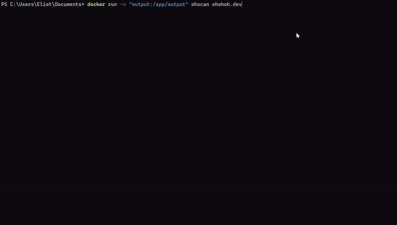
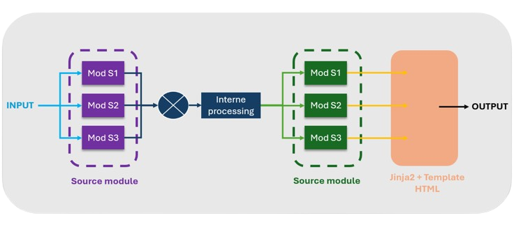

# Ohscan

```
 ▄██████▄     ▄█    █▄       ▄████████  ▄████████    ▄████████ ███▄▄▄▄   
███    ███   ███    ███     ███    ███ ███    ███   ███    ███ ███▀▀▀██▄ 
███    ███   ███    ███     ███    █▀  ███    █▀    ███    ███ ███   ███ 
███    ███  ▄███▄▄▄▄███▄▄   ███        ███          ███    ███ ███   ███ 
███    ███ ▀▀███▀▀▀▀███▀  ▀███████████ ███        ▀███████████ ███   ███ 
███    ███   ███    ███            ███ ███    █▄    ███    ███ ███   ███ 
███    ███   ███    ███      ▄█    ███ ███    ███   ███    ███ ███   ███ 
 ▀██████▀    ███    █▀     ▄████████▀  ████████▀    ███    █▀   ▀█   █▀  
                                                                         
```

> Un scanneur de nom de domaine portable et performant, conçu pour les pentests et le bug bounty.

Les avantages :
- :alarm_clock: installation rapide
- :handbag: portabilité
- :bulb: efficacité
- :wrench: modulable



## Installation

```bash
docker build -t ohscan:latest .
docker run -v "output:/app/output" ohscan
```

## Utilisation

```bash
docker run -v "output:/app/output" ohscan domain.com
```

## Fonctionnement



Le projet fonctionne à l'aide de deux types de modules :
- des modules de **sources**. Ils prennent en paramètre l'argument utilisateur et génère à partir de celui-ci une liste de données (subdomain, URL, ...).
- des modules de **post-processing**. Ils prennent en paramètre la liste générée via les modules sources et effectue des opérations qui seront affichés dans le rendu. 

Ces modules peuvent être codé directement en Python, où faire appel à des programmes externes.

## Implementé

- [httpx](https://github.com/projectdiscovery/httpx)
- [subfinder](https://github.com/projectdiscovery/subfinder)
- [waybackurl](https://github.com/tomnomnom/waybackurls)
- [puredns](https://github.com/d3mondev/puredns)
- [shosubgo](https://github.com/incogbyte/shosubgo)

## Todo

- Organiser la présentation des résultats:
    - faire une catégorie non de domaine, lien up, état inconnu
    - mettre les extensions des liens dans une certaine couleur (.js, .php)
    - mettre en rouge les paramètres d'URL
    - bien présenter le retour de httpx