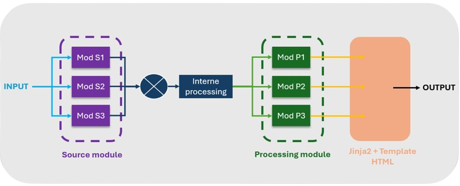

Ohscan
========

<div align="center">
  <br>
  
</div>
<p align="center">
  <a href="https://github.com/ahihuh/ohscan/blob/main/CONTRIBUTING.md"></a>
</p>

*Ohscan* est scanneur de nom de domaine opensource, dockerisé, portable et performant, conçu pour les pentests et le bug bounty.

L'objectif est de s'affranchir des scripts et configurations personnalisés en proposant une solution unifiée, tirant pleinement parti des outils disponibles.

Les avantages :
- :alarm_clock: installation simple et rapide
- :handbag: portabilité
- :bulb: efficacité
- :wrench: modulable

Installation
----------------------------

Installer et lancer docker, puis :

```bash
$ docker build -t ohscan:latest .
$ docker run -v "output:/app/output" ohscan
```

Utilisation
----------------------------

```bash
$ docker run -v "output:/app/output" ohscan domain.com
```


Demonstration
----------------------------

* Lancement d'un scan


* Présentation des résultats


Fonctionnement
----------------------------



Le projet repose sur une architecture modulaire composée de deux types principaux de modules :

* **Modules sources** : Ces modules prennent en entrée l’argument fourni par l’utilisateur (par exemple un domaine), et génèrent une liste de données à partir de celui-ci (sous-domaines, URLs, etc.).

* **Modules de post-traitement** : positionnés en fin de chaine, ces modules reçoivent la liste de données générée par les modules sources (et préalablement traitée en interne), puis réalisent des opérations supplémentaires afin de produire de nouvelles données intégrées au rendu final.

Exemples :

* Le module **subfinder**, qui s’appuie sur l’outil du même nom, est un module source.

* Le module **httpx**, également basé sur l’outil du même nom, agit comme module de post-traitement.

Chaque module peut être développé en Python ou faire appel à des programmes externes.

Le rendu final est généré sous forme HTML, en s’appuyant sur un template de base enrichi à l’aide du moteur de templates Jinja2.

Modules implémentés
----------------------------

- [httpx](https://github.com/projectdiscovery/httpx)
- [subfinder](https://github.com/projectdiscovery/subfinder)
- [waybackurl](https://github.com/tomnomnom/waybackurls)
- [puredns](https://github.com/d3mondev/puredns)
- [shosubgo](https://github.com/incogbyte/shosubgo)

Ajouter des modules
----------------------------

* Module source

Pour ajouter un module source, il suffit de créer une fonction dans le fichier `src/modules/mod_source.py`, puis de l’ajouter à la liste `MODS_SOURCE` afin qu’elle soit chargée automatiquement.

```python
def _mod__mynewmodule(domain : str) -> list:
    ...
    return generated_data
...
MODS_SOURCE = [
    ...
    {"name":"mynewmodule","f":_mod__mynewmodule},
]
```

* Module post-processing

L’ajout d’un module de post-traitement suit le même principe qu’un module source, à la différence qu’il doit être défini dans le fichier `src/modules/mod_processing.py` et référencé dans la liste `MODS_PROCESSING`.

Pour afficher les résultats, il est également nécessaire de modifier le template `assets/template.html`. Les données générées par ce module seront accessibles dans le template via la variable `data.<nom_du_module>`.

Contribution
----------------------------

Si vous avez envie de contribuer au projet en ajoutant de nouveaux modules, en corrigeant des bugs ou en proposant des améliorations, ce sera avec grand plaisir ! Je suis toujours disponible pour échanger et discuter :heart:.

## Todo list

- Organiser la présentation des résultats:
    - faire une catégorie non de domaine, lien up, état inconnu
    - mettre les extensions des liens dans une certaine couleur (.js, .php)
    - mettre en rouge les paramètres d'URL
    - bien présenter le retour de httpx